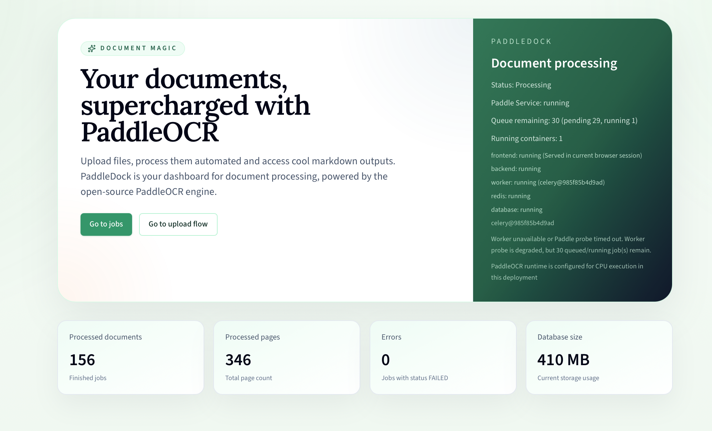
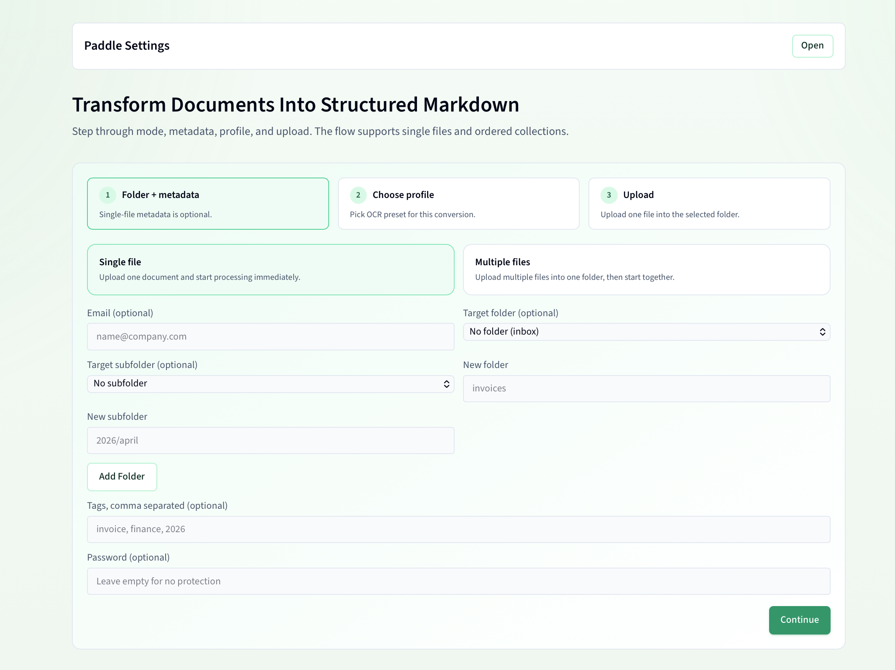
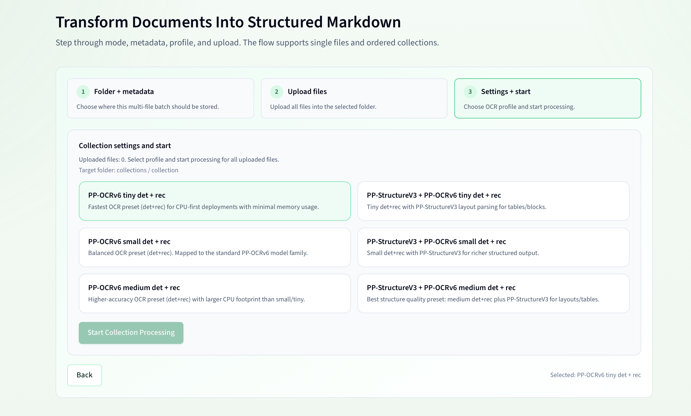
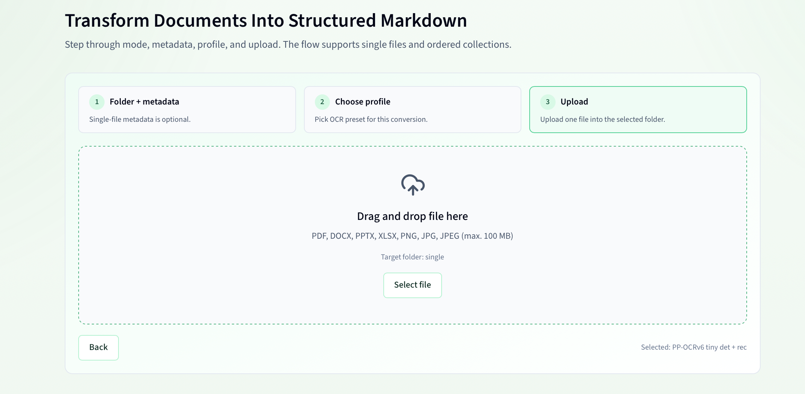
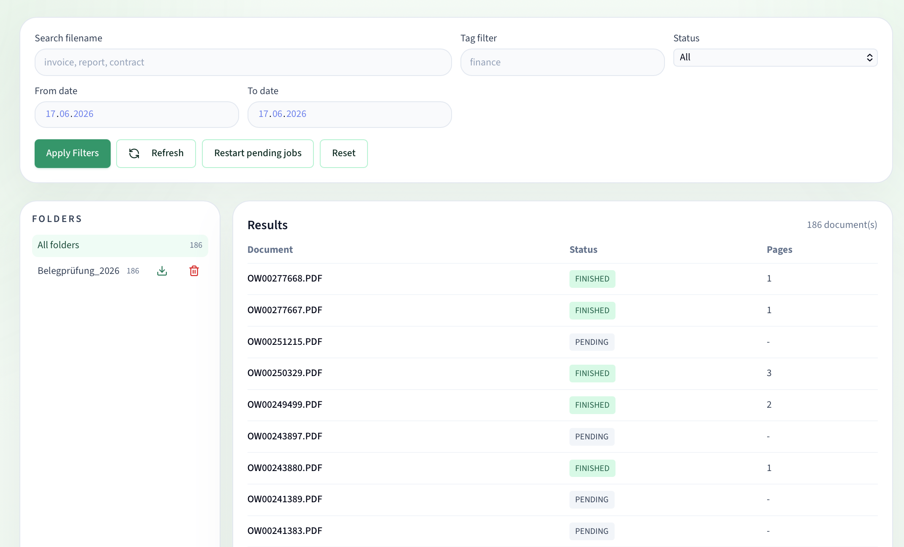
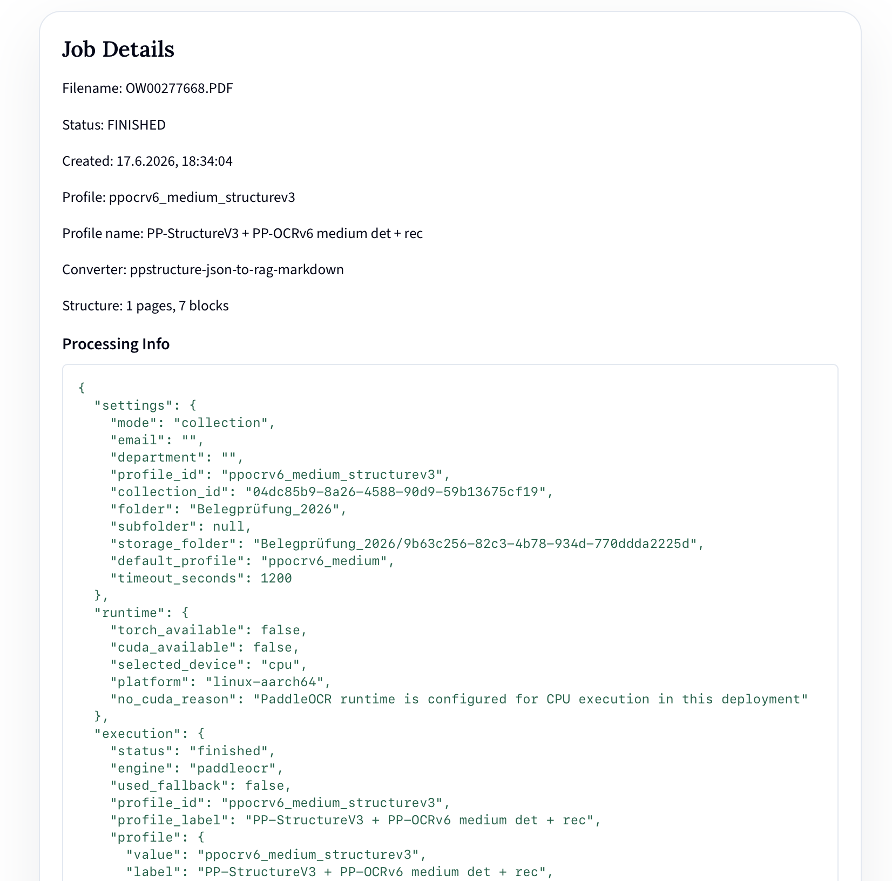

# PaddleDock

PaddleDock is a document processing web app powered by PaddleOCR. Upload PDFs, Office files, or images and get structured Markdown output — organized in folders, searchable by tag, and optionally password-protected.

---

## User Guide

### Home — `/`



The home page shows the current service status (CPU or GPU runtime, Paddle service health) and global processing statistics. Use the navigation buttons to go to **Processing** or **Jobs**.

| Stat | What it shows |
|---|---|
| Processed documents | Count of all `FINISHED` jobs |
| Processed pages | Total pages across all finished jobs |
| Errors | Count of `FAILED` jobs |
| Database size | Postgres database or payload size estimate |

---

### Processing — `/processing`



The processing wizard has three steps:

**Step 1 — Folder & metadata**

- Choose between **Single file** (upload one document, processing starts immediately) or **Multiple files** (batch upload into one folder, then trigger processing together).
- Optionally fill in email, department, folder/subfolder path, tags, and a **password**.
  - If a password is set, only someone who knows it can later view, download, edit, or delete the job result.
- Click **Add Folder** to pre-create a folder in storage before uploading.



**Step 2 — Choose OCR profile**

Select the PaddleOCR profile to use. Each profile trades off speed versus accuracy:

| Profile | Description |
|---|---|
| PP-OCRv6 Tiny (det+rec) | Fastest OCR mode |
| PP-OCRv6 Small (det+rec) | Balanced speed and quality |
| PP-OCRv6 Medium (det+rec) | Highest OCR accuracy |
| PP-StructureV3 variants | Adds stronger layout/table structure extraction |



**Step 3 — Upload**

Drag and drop a file or click to open the file picker. Supported formats: **PDF, DOCX, PPTX, XLSX, PNG, JPG, JPEG**.

For **Multiple files** mode, upload each file individually — they are all added to the same folder/collection. When all files are staged, click **Start processing** to kick off OCR for the entire batch.

---

### Jobs — `/jobs`



The jobs page lists all processing jobs. Use the folder tree on the left to filter by folder path, or the search bar and filters to find specific documents.

**Filter bar**

| Field | Behaviour |
|---|---|
| Search filename | Partial match on the original filename |
| Tag filter | Exact tag match |
| From / To date | Filters by job creation date |

**Folder tree**

Folders created during upload appear as a tree in the sidebar. Click a folder to show only documents in that branch. The trash icon next to a folder name deletes the folder and all jobs inside it.

**Job row**

Each row shows the job ID, original filename, and status badge. Click the filename to open the **Job Detail** page.

---

### Job Detail — `/jobs/{id}`



The detail page shows full job metadata, OCR execution info, and the generated Markdown.

- **Download Markdown** — downloads the `.md` result file.
- **Preview / Edit** toggle — switch between a read-only preview and an inline editor. Saving creates a new versioned copy on disk.
- **Password-protected jobs** — if the job was uploaded with a password, the page shows an unlock form before any content is displayed.

---

## Core Features

- Upload via drag and drop or file picker
- Supported formats: PDF, DOCX, PPTX, XLSX, PNG, JPG, JPEG
- Job lifecycle: `PENDING` → `RUNNING` → `FINISHED` / `FAILED`
- Optional password protection per job (bcrypt-hashed, enforces access on view / download / edit / delete)
- Folder-based storage for uploads and results, browsable as a tree
- Optional tags per upload
- Search and filtering by filename, tag, and date range
- Global stats (processed documents, pages, errors, database size)
- Versioned Markdown editor on the job detail page

## Architecture

```text
frontend  (Next.js + TypeScript + Tailwind + framer-motion)
backend   (FastAPI + SQLAlchemy + Alembic + Celery)
postgres  (default in Docker)
redis     (queue/broker)
worker    (Celery worker)
```

Local file storage:

```text
backend/storage/uploads/single/<job_id>
backend/storage/uploads/collections/<collection_id>/<job_id>
backend/storage/results/single/<job_id>
backend/storage/results/collections/<collection_id>/<job_id>
backend/storage/results/.../edited
```

## Key API Endpoints

- `POST /api/v1/upload`
- `GET /api/v1/jobs`
- `GET /api/v1/jobs/{job_id}`
- `GET /api/v1/jobs/{job_id}/preview`
- `GET /api/v1/jobs/{job_id}/download`
- `PUT /api/v1/jobs/{job_id}/save`
- `DELETE /api/v1/jobs/{job_id}`
- `GET /api/v1/stats`
- `GET /api/v1/health`
- `GET /api/v1/paddle/status`
- `GET /api/v1/paddle/settings`
- `PUT /api/v1/paddle/settings`
- `GET /api/v1/paddle/capabilities`

## Run With Docker

```bash
docker compose up --build
```

Services:

- Frontend: http://localhost:3000
- Backend: http://localhost:8000

### Scale Workers Safely

PaddleDock supports multiple worker replicas:

```bash
docker compose up --build -d --scale worker=2
```

To tune for smaller hosts (especially ARM), copy `.env.example` to `.env` and adjust values before starting Compose:

```bash
cp .env.example .env
docker compose up --build -d --scale worker=2
```

Recommended baseline on memory-constrained machines:

- `WORKER_MEMORY_LIMIT=2g` to `3g`
- `CELERY_WORKER_CONCURRENCY=1`
- `CELERY_MAX_TASKS_PER_CHILD=5`
- `OMP_NUM_THREADS=1`
- `ONNXRUNTIME_INTRA_OP_NUM_THREADS=1`

Worker restart behavior:

- Compose uses `restart: unless-stopped`.
- If a worker container dies unexpectedly, jobs that were `RUNNING` are re-queued automatically when workers start again.
- In multi-worker mode, startup recovery is lock-protected so only one worker performs re-queue logic.

## Run With Helm (Kubernetes)

The repo now includes an open-source Helm chart in `charts/paddledock`.

Quick install:

```bash
helm upgrade --install paddledock ./charts/paddledock \
  --namespace paddledock --create-namespace
```

PaddleDock HA queue profile example:

```bash
helm upgrade --install paddledock ./charts/paddledock \
  --namespace paddledock --create-namespace \
  -f ./charts/paddledock/examples/paddledock-ha-queue-oss.yaml
```

Notes:

- Set `frontend.apiUrl` to a browser-reachable backend URL (usually your backend ingress host).
- Default mode runs migrations in backend startup (`backend.runAlembicOnStartup=true`). For multi-replica backend setups, prefer `migrationJob.enabled=true` with `backend.runAlembicOnStartup=false`.
- PostgreSQL is external-only in Helm. Configure `database.*` and `database.passwordSecret` in values.
- Shared storage for backend+worker expects `ReadWriteMany` if `persistence.enabled=true`.

## Local Development

Backend:

```bash
cd backend
python -m pip install -r requirements.txt
pytest -q
uvicorn app.main:app --reload
```

Frontend:

```bash
cd frontend
npm install
npm run build
npm run dev
```

## Migrations

- `backend/alembic/versions/0001_init.py`
- `backend/alembic/versions/0002_job_processing_info.py`
- `backend/alembic/versions/0002_job_blob_tags.py`
