# PaddleDock

PaddleDock is a document processing web app powered by PaddleOCR. Upload PDFs, Office files, or images and get structured Markdown output — organized in folders, searchable by tag, and optionally password-protected.

## Built for RAG Pipelines

PaddleDock is designed as an ingestion and normalization layer for Retrieval-Augmented Generation (RAG) pipelines. It converts raw PDFs, Office files, and images into structured, searchable Markdown that downstream chunking, embedding, and retrieval systems can consume reliably.

### Why Grade A Documents Matter for RAG

High-quality source documents are critical for reliable RAG outcomes:

- Better retrieval precision through cleaner structure and metadata
- Better answer accuracy by reducing OCR and layout noise
- Lower hallucination risk through stronger grounding context
- Better token efficiency by avoiding irrelevant or duplicated text
- Higher trust and auditability with consistent, traceable source output

---

## User Guide

### Home — `/`


The home page shows the current service status (CPU or GPU runtime, Paddle service health) and global processing statistics. Use the navigation buttons to go to **Processing** or **Jobs**.

| Stat | What it shows |
|---|---|
| Processed documents | Count of all `FINISHED` jobs |
| Processed pages | Total pages across all finished jobs |
| Errors | Count of `FAILED` jobs |
| Database size | Postgres database or payload size estimate |

---

### Processing — `/processing`


The processing wizard has three steps:

**Step 1 — Folder & metadata**

- Choose between **Single file** (upload one document, processing starts immediately) or **Multiple files** (batch upload into one folder, then trigger processing together).
- Optionally fill in email, department, folder/subfolder path, tags, and a **password**.
  - If a password is set, only someone who knows it can later view, download, edit, or delete the job result.
- Click **Add Folder** to pre-create a folder in storage before uploading.


**Step 2 — Choose OCR profile**

Select the PaddleOCR profile to use. Each profile trades off speed versus accuracy:

| Profile | Description |
|---|---|
| PP-OCRv6 Tiny (det+rec) | Fastest OCR mode |
| PP-OCRv6 Small (det+rec) | Balanced speed and quality |
| PP-OCRv6 Medium (det+rec) | Highest OCR accuracy |
| PP-StructureV3 variants | Adds stronger layout/table structure extraction |
| PaddleOCR-VL 1.6 (0.9B) | Vision-language parsing profile for richer document understanding (best on GPU) |
| OpenAI-compatible Vision API | Sends each page to any OpenAI-compatible vision endpoint (`gpt-4o`, Ollama, LiteLLM, etc.) |


**Step 3 — Upload**

Drag and drop a file or click to open the file picker. Supported formats: **PDF, DOCX, PPTX, XLSX, PNG, JPG, JPEG**.

For **Multiple files** mode, upload each file individually — they are all added to the same folder/collection. When all files are staged, click **Start processing** to kick off OCR for the entire batch.

---

### Jobs — `/jobs`


The jobs page lists all processing jobs. Use the folder tree on the left to filter by folder path, or the search bar and filters to find specific documents.

**Filter bar**

| Field | Behaviour |
|---|---|
| Search filename | Partial match on the original filename |
| Tag filter | Exact tag match |
| From / To date | Filters by job creation date |

**Folder tree**

Folders created during upload appear as a tree in the sidebar. Click a folder to show only documents in that branch. The trash icon next to a folder name deletes the folder and all jobs inside it.

**Job row**

Each row shows the job ID, original filename, and status badge. Click the filename to open the **Job Detail** page.

---

### Job Detail — `/jobs/{id}`


The detail page shows full job metadata, OCR execution info, and the generated Markdown.

- **Download Markdown** — downloads the `.md` result file.
- **Preview / Edit** toggle — switch between a read-only preview and an inline editor. Saving creates a new versioned copy on disk.
- **Password-protected jobs** — if the job was uploaded with a password, the page shows an unlock form before any content is displayed.

---

## Core Features

- Upload via drag and drop or file picker
- Supported formats: PDF, DOCX, PPTX, XLSX, PNG, JPG, JPEG
- RAG-first output design: structured Markdown optimized for chunking, embedding, and retrieval
- Job lifecycle: `PENDING` → `RUNNING` → `FINISHED` / `FAILED`
- Optional password protection per job (bcrypt-hashed, enforces access on view / download / edit / delete)
- Folder-based storage for uploads and results, browsable as a tree
- Optional tags per upload
- Search and filtering by filename, tag, and date range
- Global stats (processed documents, pages, errors, database size)
- Versioned Markdown editor on the job detail page

## Architecture

```text
frontend  (Next.js + TypeScript + Tailwind + framer-motion)
backend   (FastAPI + SQLAlchemy + Alembic + Celery)
postgres  (default in Docker)
redis     (queue/broker)
worker    (Celery worker)
```

Local file storage:

```text
backend/storage/uploads/single/<job_id>
backend/storage/uploads/collections/<collection_id>/<job_id>
backend/storage/results/single/<job_id>
backend/storage/results/collections/<collection_id>/<job_id>
backend/storage/results/.../edited
```

## Key API Endpoints

- `POST /api/v1/upload`
- `GET /api/v1/jobs`
- `GET /api/v1/jobs/{job_id}`
- `GET /api/v1/jobs/{job_id}/preview`
- `GET /api/v1/jobs/{job_id}/download`
- `PUT /api/v1/jobs/{job_id}/save`
- `DELETE /api/v1/jobs/{job_id}`
- `GET /api/v1/stats`
- `GET /api/v1/health`
- `GET /api/v1/paddle/status`
- `GET /api/v1/paddle/settings`
- `PUT /api/v1/paddle/settings`
- `GET /api/v1/paddle/capabilities`

## n8n Integration

PaddleDock can be used directly from n8n using HTTP Request nodes.

Typical single-file automation flow:

1. **Upload** document to PaddleDock
  - `POST /api/v1/upload` (multipart form-data)
  - send `file` plus optional metadata (`profile_id`, `folder`, `subfolder`, `tags`)
2. **Poll** job status until completion
  - `GET /api/v1/jobs/{job_id}`
  - continue until status is `FINISHED` or `FAILED`
3. **Fetch result** for downstream RAG steps
  - `GET /api/v1/jobs/{job_id}/preview` (markdown text)
  - or `GET /api/v1/jobs/{job_id}/download` (file)

If n8n runs in Docker with PaddleDock, use the internal backend URL (for example `http://backend:8000`).
If n8n runs on your host machine, use `http://localhost:8000`.

```mermaid
flowchart LR
   A[Document Source\nPDF DOCX PPTX XLSX PNG JPG] --> B[n8n Trigger\nWebhook / Schedule / Drive Watch]
   B --> C[n8n HTTP Request\nPOST /api/v1/upload]
   C --> D[PaddleDock Queue\nCelery + Worker]
   D --> E[PaddleOCR Processing\nStructured Markdown Output]
  E --> F[n8n Poll Loop\nGET /api/v1/jobs/job-id]
   F --> G[n8n Fetch Result\nGET preview or download]
   G --> H[RAG Ingestion\nChunk + Embed + Index]
   H --> I[Retrieval + Answering\nVector Search + LLM]
```



## Run With Docker

```bash
docker compose up --build
```

Services:

- Frontend: http://localhost:3000
- Backend: http://localhost:8000

### Build targets

Three images are built from this repository:

| Image | Build context | Notes |
|---|---|---|
| `frontend` | `frontend/Dockerfile` | Next.js production build (multi-stage, Node 26 Alpine) |
| `backend` | `backend/Dockerfile` | FastAPI API server (Python 3.13-slim) |
| `worker` | `backend/worker.Dockerfile` | Celery worker bundling PaddleOCR + GPU-capable PaddlePaddle |

The same `worker` image is used for both CPU and GPU runs: it ships `paddlepaddle-gpu` and auto-detects CUDA at runtime, falling back to CPU when no GPU is reserved. The first `worker` build downloads a large (~1.9 GB) PaddlePaddle wheel plus PaddleOCR model dependencies, so the initial build can take several minutes.

### Windows + NVIDIA GPU (PaddleOCR-VL profile)

For Docker Desktop on Windows with NVIDIA GPU support, use the GPU override file to switch the worker default profile to `paddlevl_1_6_0_9b`.

```powershell
Copy-Item .env.example .env
docker compose -f docker-compose.yml -f docker-compose.gpu.yml up --build -d
```

Optional quick check:

```powershell
docker compose -f docker-compose.yml -f docker-compose.gpu.yml ps
```

The override only adds the NVIDIA device reservation and switches the worker default profile to `paddlevl_1_6_0_9b` — it does not build a separate image, so no extra image rebuild is required to switch between CPU and GPU.

If you want to force PaddleOCR-VL per upload from API/n8n, set `profile_id=paddlevl_1_6_0_9b` in the upload request.

#### How GPU auto-detection works

The worker image ships `paddlepaddle-gpu` (CUDA 12.6 build). At container startup the worker checks:

1. `paddle.is_compiled_with_cuda()` and `paddle.device.cuda.device_count() > 0`
2. Falls back to `torch.cuda.is_available()` if PaddlePaddle is unavailable

The result is exposed as `selected_device: "gpu" | "cpu"` in the `/api/v1/paddle/status` response and shown on the home page status panel.

When no NVIDIA device is reserved (plain `docker compose up`), the worker runs on CPU and selects a lighter default profile automatically. No config change is needed to switch — just start with or without `docker-compose.gpu.yml`.

#### GPU memory and Celery settings

The PaddleOCR-VL 1.6 model requires ~6–10 GB of GPU VRAM. The GPU override sets:

| Setting | Value | Reason |
|---|---|---|
| `mem_limit` | `12g` | Prevents OOM kill during model load |
| `cpus` | `4.0` | Adequate for pre/post-processing |
| `CELERY_WORKER_POOL` | `solo` | Avoids fork-after-CUDA-init crashes |
| `CELERY_WORKER_CONCURRENCY` | `1` | One job at a time to share GPU memory |
| `CELERY_MAX_TASKS_PER_CHILD` | `1` | Recycles the worker process after each job to free VRAM |

### Scale Workers Safely

PaddleDock supports multiple worker replicas:

```bash
docker compose up --build -d --scale worker=2
```

To tune for smaller hosts (especially ARM), copy `.env.example` to `.env` and adjust values before starting Compose:

```bash
cp .env.example .env
docker compose up --build -d --scale worker=2
```

Recommended baseline on memory-constrained machines:

- `WORKER_MEMORY_LIMIT=2g` to `3g`
- `CELERY_WORKER_CONCURRENCY=1`
- `CELERY_MAX_TASKS_PER_CHILD=5`
- `OMP_NUM_THREADS=1`
- `ONNXRUNTIME_INTRA_OP_NUM_THREADS=1`

Worker restart behavior:

- Compose uses `restart: unless-stopped`.
- If a worker container dies unexpectedly, jobs that were `RUNNING` are re-queued automatically when workers start again.
- In multi-worker mode, startup recovery is lock-protected so only one worker performs re-queue logic.

## Run With Helm (Kubernetes)

The repo now includes an open-source Helm chart in `charts/paddledock`.

Quick install:

```bash
helm upgrade --install paddledock ./charts/paddledock \
  --namespace paddledock --create-namespace
```

PaddleDock HA queue profile example:

```bash
helm upgrade --install paddledock ./charts/paddledock \
  --namespace paddledock --create-namespace \
  -f ./charts/paddledock/examples/paddledock-ha-queue-oss.yaml
```

Notes:

- Set `frontend.apiUrl` to a browser-reachable backend URL (usually your backend ingress host).
- Default mode runs migrations in backend startup (`backend.runAlembicOnStartup=true`). For multi-replica backend setups, prefer `migrationJob.enabled=true` with `backend.runAlembicOnStartup=false`.
- PostgreSQL is external-only in Helm. Configure `database.*` and `database.passwordSecret` in values.
- Shared storage for backend+worker expects `ReadWriteMany` if `persistence.enabled=true`.

## Local Development

Backend:

```bash
cd backend
python -m pip install -r requirements.txt
pytest -q
uvicorn app.main:app --reload
```

Frontend:

```bash
cd frontend
npm install
npm run build
npm run dev
```

## Migrations

- `backend/alembic/versions/0001_init.py`
- `backend/alembic/versions/0002_add_password_protection.py`
- `backend/alembic/versions/0002_job_blob_tags.py`
- `backend/alembic/versions/0002_job_processing_info.py`

## Troubleshooting

### OpenAI-compatible Vision API profile

PaddleDock includes an `openai_vision` profile that sends each document page as a base64 PNG to any OpenAI chat-completions-compatible endpoint and asks the model to return structured Markdown. This works with the hosted OpenAI API, Azure OpenAI, Ollama, LiteLLM, vLLM, and any other endpoint that implements `POST /v1/chat/completions` with vision support.

#### Configuration

Set two environment variables before starting the stack. The simplest way is a `.env` file in the repo root:

```dotenv
OPENAI_API_BASE_URL=https://api.openai.com
OPENAI_API_BEARER_TOKEN=sk-your-key-here
```

For a local Ollama instance:

```dotenv
OPENAI_API_BASE_URL=http://host.docker.internal:11434
OPENAI_API_BEARER_TOKEN=ollama
```

For LiteLLM or a custom proxy:

```dotenv
OPENAI_API_BASE_URL=http://litellm:4000
OPENAI_API_BEARER_TOKEN=sk-litellm-key
```

The variables are passed to both the `backend` and `worker` containers. No image rebuild is needed — change `.env` and restart:

```bash
docker compose up -d --no-deps backend worker
```

#### How pages are sent

For each PDF page the worker:

1. Renders the page to a PNG at 2× scale (~144 dpi) using `pypdfium2`
2. Base64-encodes the image and posts it to `{OPENAI_API_BASE_URL}/v1/chat/completions`
3. Asks the model to return the full page as GFM Markdown (headings, lists, tables)
4. Assembles all page responses into one document with RAG frontmatter and the standard quality gate

Image files (PNG/JPG/JPEG) are sent directly without page splitting.

#### Model selection

The default model is `gpt-4o`. To use a different model, the profile `vision_model` key can be overridden at the service level or by creating a custom profile in `backend/app/services/paddle_service.py`. Examples:

| Provider | Model value |
|---|---|
| OpenAI | `gpt-4o`, `gpt-4o-mini` |
| Ollama | `llava`, `llama3.2-vision` |
| Azure OpenAI | deployment name configured on the proxy |

#### Using from n8n or API

Set `profile_id=openai_vision` in the upload request:

```bash
curl -F "file=@invoice.pdf" -F "profile_id=openai_vision" http://localhost:8000/api/v1/upload
```

---

## Troubleshooting

### Windows: dashboard loads but stats, status, profiles, or jobs stay empty

If the UI renders but no data loads, the browser usually cannot reach the backend on `http://localhost:8000`. On Docker Desktop + WSL2 the host can intermittently resolve `localhost` to IPv6 (`::1`), where a stale `wslrelay` listener drops connections to the published backend port while the containers still reach each other fine over the internal network.

Fixes:

- Recreate the backend container to rebuild a clean host port forward:

  ```powershell
  docker compose -f docker-compose.yml -f docker-compose.gpu.yml up -d --force-recreate --no-deps backend
  ```

- Or point the browser at IPv4 explicitly by setting `NEXT_PUBLIC_API_URL=http://127.0.0.1:8000` on the frontend service, then rebuild the frontend.

Verify host reachability:

```powershell
curl.exe -s -o NUL -w "%{http_code}\n" http://127.0.0.1:8000/api/v1/health
```

## Backlog / Roadmap

### 1) RAG Quality Foundation

- [ ] Define measurable success metrics
  - Targets for OCR quality, retrieval precision/recall, and processing cost per page
  - Baseline dashboard for current performance before optimization
  - Weekly trend tracking to catch regressions early

- [x] Build a document quality gate (Grade A/B/C)
  - Score documents from OCR confidence, structure quality, and text-noise heuristics
  - Include page- and table-level signals where available, not just whole-page edit distance
  - Label each processed document as Grade A, B, or C and warn or block non-Grade-A output before indexing

- [ ] Add a RAG evaluation harness
  - Curated benchmark dataset (invoices, contracts, scanned and born-digital docs)
  - Retrieval metrics: precision@k, recall@k, hit@k
  - Regression checks in CI for extraction and retrieval quality

### 2) Reliability and Operations

- [ ] Improve observability and incident response
  - Structured logs with request/job correlation IDs across frontend, API, and worker
  - Metrics for queue depth, processing latency, retries, and failure rate
  - Alerts for stuck RUNNING jobs and unhealthy worker pools

- [ ] Strengthen security and governance
  - Strict file validation and content-type enforcement on upload
  - Optional malware scanning in ingest path
  - Audit log for view, download, edit, and delete events
  - Role-based access control for multi-team usage

### 3) Delivery and Developer Workflow

- [ ] Add CI/CD automation and release hardening
  - Run lint, tests, and container build on every PR
  - Publish multi-arch images (linux/amd64 and linux/arm64) on tags
  - Add vulnerability scanning and software bill of materials (SBOM)
  - Sign release images and enforce immutable version tags

### 4) Product and Ecosystem

- [ ] Improve processing UX and operator feedback
  - Batch progress and queue position visibility
  - Per-document quality issue panel with actionable hints
  - Retry and recovery UX for partial collection failures

- [ ] Add RAG ecosystem integrations
  - Export pipelines for Qdrant, Weaviate, Pinecone, and pgvector
  - Webhook events for job finished, failed, and quality-gate outcomes
  - Optional normalized JSON output alongside Markdown

### 5) Release Milestone

- [ ] Ship v0.2.0 focused on RAG quality and reliability
  - Include quality gate, evaluation harness, core observability, and CI/CD publishing
  - Publish release notes with benchmark deltas vs v0.1.0
  - Define upgrade and migration guidance for existing users
