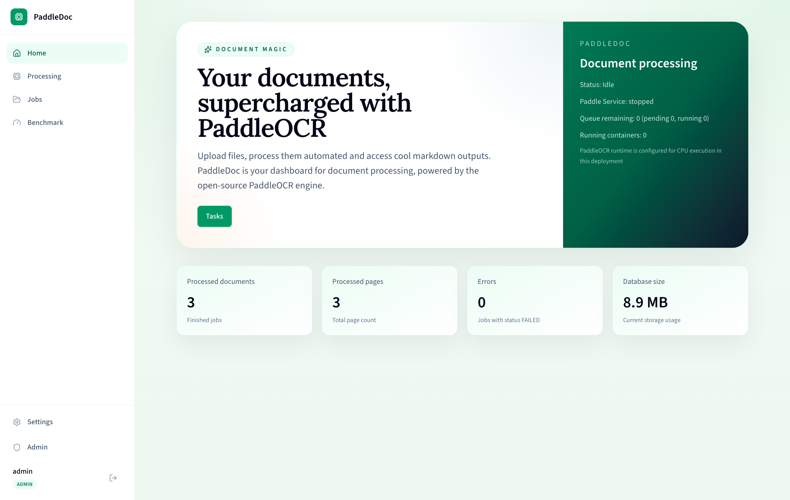
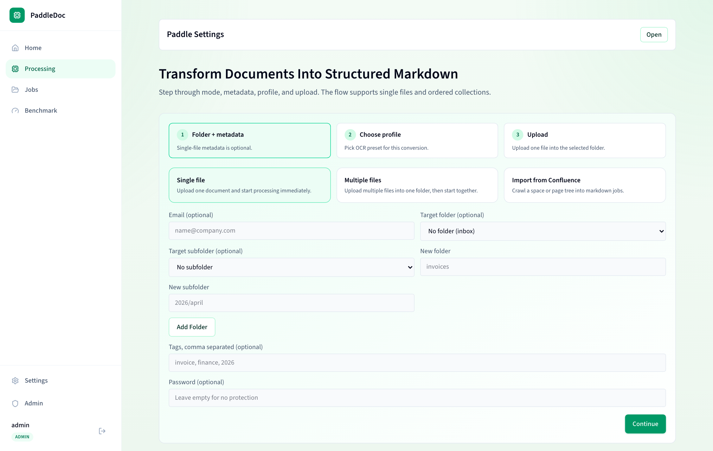
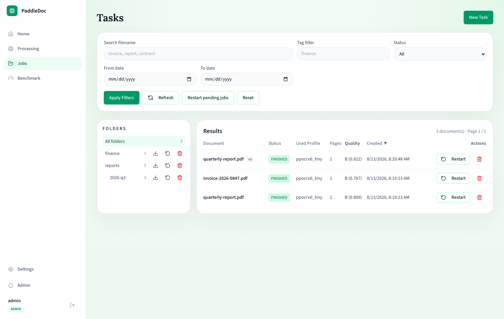
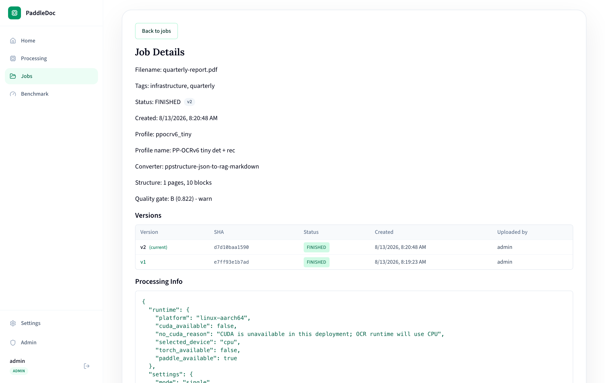
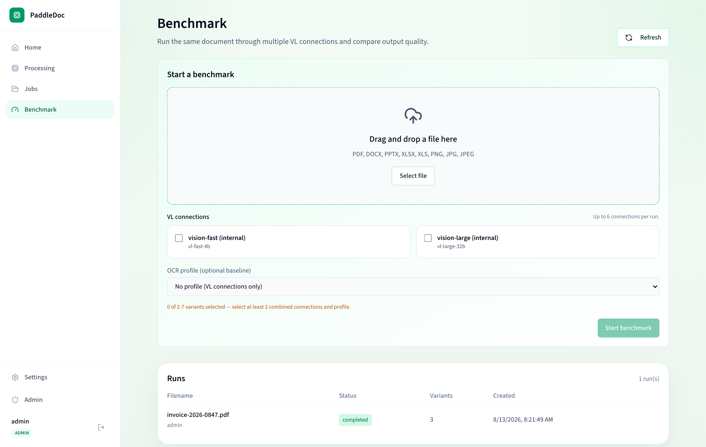
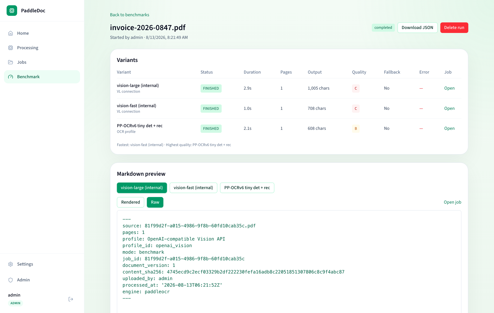
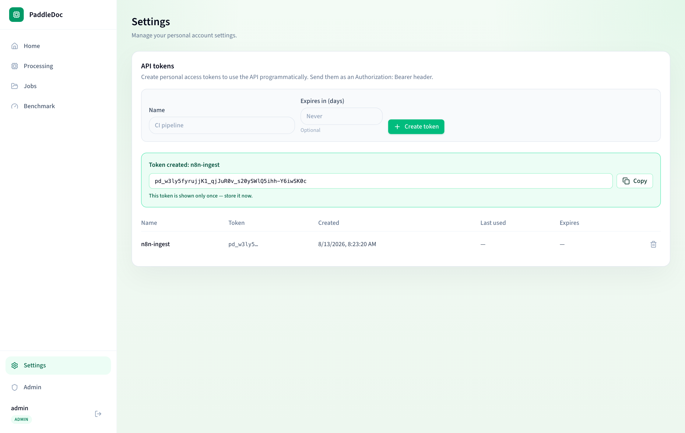
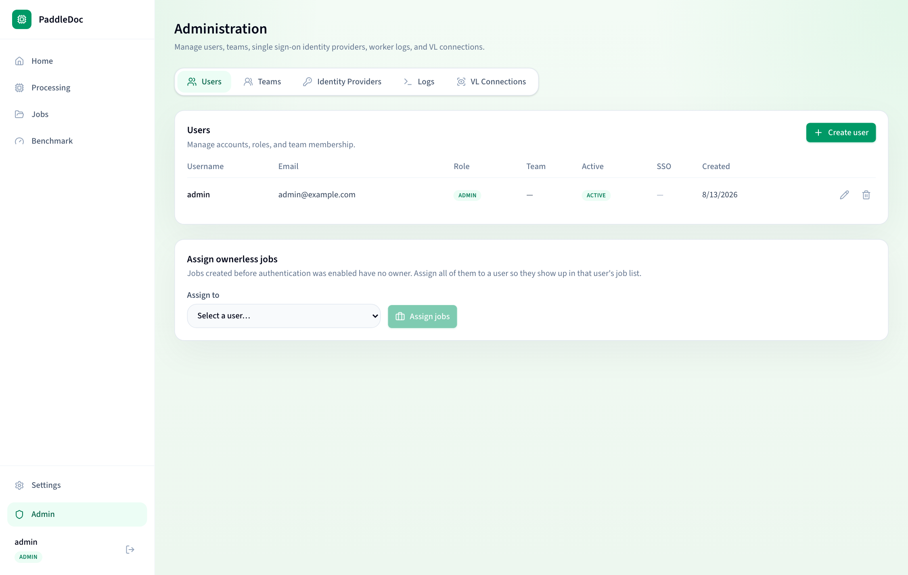
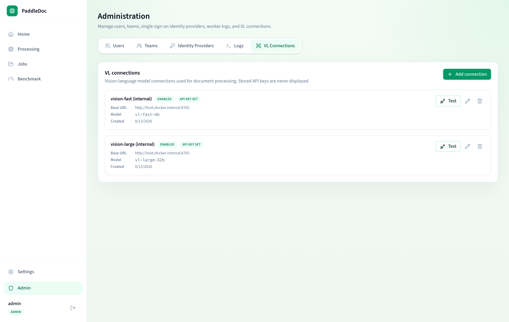
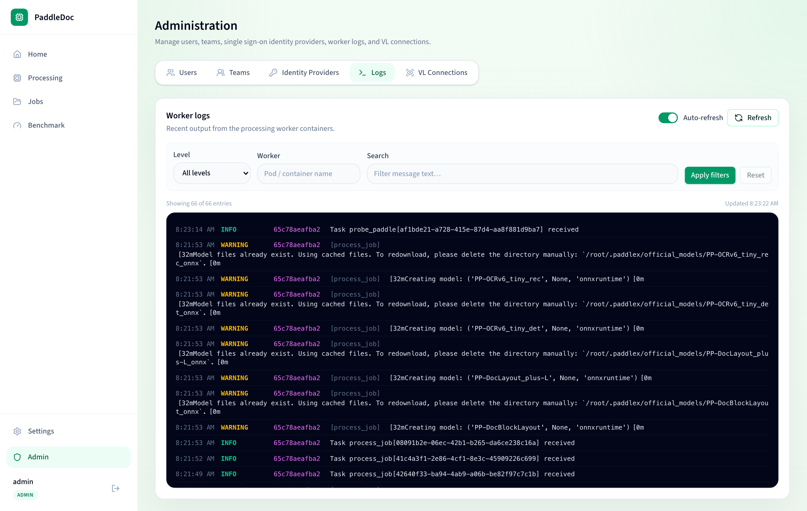

#  PaddleDoc

PaddleDoc is a document processing platform powered by PaddleOCR that converts PDFs, Office files, Mails and images into structured Markdown for RAG and AI pipelines.

It is built for teams that need reliable ingestion quality, searchable outputs, and simple deployment options from standalone NAS Docker to Kubernetes.



## Why PaddleDoc

Managing OCR and document normalization at scale gets messy fast. PaddleDoc gives you one workflow for ingestion, extraction, quality scoring, versioning, and retrieval-ready output.

- AI-first Markdown output with rich YAML frontmatter (source, hash, version, uploader, team, engine)
- **Document versioning built in** — re-uploading a changed file becomes version N+1 with full history; byte-identical re-uploads are detected and skipped
- Multiple OCR and vision profiles (fast OCR, layout-aware, VL, OpenAI-compatible)
- **VL benchmark** — run one document against up to 6 vision-language models plus an OCR baseline and compare the results side by side
- **Personal API tokens** — programmatic access via `Authorization: Bearer`, no cookie handling
- **Mail ingestion (since v1.3.0)** — POST a raw email and PaddleDoc parses it, renders the body
  to Markdown, and OCRs every attachment as its own job; idempotent by content hash
- Folder and tag organization, search, quality grades, JSON export per job
- Queue-based processing with backend + worker separation; worker logs live in the admin console
- User accounts with team visibility, local login and OIDC SSO (Keycloak, Microsoft Entra ID)

## Get Started

Choose your deployment mode:

| Mode | Best for | Command |
|---|---|---|
| Standalone Docker | Local server or NAS (UGREEN/QNAP/Synology) | `docker compose -f docker-compose.nas.yml up -d` |
| Docker (Dev/Single Host) | Local development with local builds | `docker compose up --build` |
| Docker + NVIDIA GPU | Windows Docker Desktop with GPU-enabled worker profile | `docker compose -f docker-compose.yml -f docker-compose.gpu.yml up -d --build` |
| Kubernetes (Helm) | k3s/k8s clusters and scale-out deployments | `helm upgrade --install paddledoc ./charts/paddledoc -n paddledoc --create-namespace --set auth.secretKey.value=$(openssl rand -hex 32)` |

### Standalone NAS (No Kubernetes)

Use prebuilt GHCR images and persistent local folders.

```bash
docker compose -f docker-compose.nas.yml up -d
```

Before first production run, set strong credentials/environment values (e.g. in a `.env` file next to the compose file — see `.env.example`):

```bash
POSTGRES_USER=paddledoc
POSTGRES_PASSWORD=change-this
POSTGRES_DB=paddledoc
PADDLEDOC_TAG=latest
PADDLEDOC_PUBLIC_API_URL=http://NAS_IP:8000

# Since v1.1.0 (authentication):
SECRET_KEY=generate-with-openssl-rand-hex-32   # signs sessions, encrypts stored secrets — set once, never change
REDIS_PASSWORD=change-this-too
PUBLIC_API_URL=http://NAS_IP:8000              # backend URL used for OIDC redirect URIs
CORS_ORIGINS=["http://NAS_IP:3000"]            # your frontend origin(s); no wildcard — cookies are credentialed
```

Endpoints:

- Frontend: `http://NAS_IP:3000`
- Backend: `http://NAS_IP:8000`

First run: open `http://NAS_IP:3000/setup` and create the initial admin account. Everything else requires a login from then on. Database migrations run automatically on backend startup.

### Docker (Local Build)

```bash
docker compose up --build
```

Endpoints:

- Frontend: `http://localhost:3000`
- Backend: `http://localhost:8000`

### Kubernetes (Helm)

Quick install from local chart:

```bash
helm upgrade --install paddledoc ./charts/paddledoc \
  --namespace paddledoc --create-namespace \
  --set auth.secretKey.value=$(openssl rand -hex 32)
```

Install from GHCR OCI chart:

```bash
helm install paddledoc oci://ghcr.io/bl0rb/charts/paddledoc --version 1.3.0 \
  --namespace paddledoc --create-namespace \
  --set auth.secretKey.value=$(openssl rand -hex 32)
```

Since chart 1.1.0 a `SECRET_KEY` is required — the chart refuses to render without `auth.secretKey.value` or `auth.secretKey.existingSecret` (prefer the latter in real deployments, e.g. provisioned via External Secrets Operator). More chart options and examples are in [charts/paddledoc/README.md](charts/paddledoc/README.md).

## Core Features

- Upload via drag and drop or file picker (PDF, DOCX, PPTX, XLSX, XLS, PNG, JPG, JPEG)
- **Content-hash document versioning**: same-named uploads within a team become version chains with full history; identical content is deduplicated
- Job lifecycle `PENDING -> RUNNING -> FINISHED / FAILED` with adaptive live updates
- Folder tree navigation, tags, search and filtering, date ranges
- A/B/C document quality gate per job
- Versioned markdown editing on the job detail page
- **JSON export per job** — metadata, uploader, processing details, and markdown in one file
- **VL benchmark** with per-variant metrics and side-by-side markdown comparison
- **Personal API tokens** for programmatic access (created on the Settings page, shown once, stored hashed)
- **Mail ingestion (since v1.3.0)** — POST a raw RFC-822 email, body renders to Markdown, attachments become regular jobs; idempotent by content hash, with a Mail UI and manual `.eml` upload
- **Worker logs in the admin console** — level/worker/text filters, auto-refresh, tracebacks
- Password-gated view/download/edit/delete per job
- OpenAI-compatible page-by-page vision profile
- User accounts with per-user/team data visibility, local login and OIDC SSO
- Admin console for users, teams, identity providers, worker logs, and VL connections

## Product Walkthrough

### Home (`/`)

System health, selected runtime (CPU/GPU), queue state, and global statistics — with honest degradation: if the backend becomes unreachable, the dashboard marks data as "last known" instead of pretending it is current.

### Processing (`/processing`)



Guided flow: choose single-file or collection mode, add metadata (folder/subfolder, tags, department, optional password), select the OCR profile, upload. Re-entering the flow is instant — profiles and settings render from cache and revalidate in the background.

### Tasks (`/jobs`)



Browse all jobs with folder tree, filters, quality grades, and version badges — `v2` marks documents that were re-uploaded with changed content.

### Job Detail (`/jobs/{id}`)



Review metadata, quality gate, and processing info; preview or edit markdown; download the result as Markdown or JSON. The **Versions** table shows the full history of the document — who uploaded which version when, with content hashes — and links to every prior version.

### Mail (`/mail`)

Ingested email messages, their rendered body, and the attachment jobs derived from them. Upload `.eml` files directly (drag and drop or file picker) the same way a mail gateway would, or POST them via the API — see [API Quickstart](#api-quickstart) below. The list is filterable by subject/sender, source, and date range; each message shows an aggregate status rolled up from its attachment jobs.

Open a message to see the full envelope, the body rendered as Markdown, and a parts table — every attachment links to its OCR job, with per-part downloads and a raw `.eml` download for the whole message. The page polls while any attachment job is still processing. Attachment jobs carry a "from mail" badge back to their source message on the Tasks list and Job Detail pages.

### Benchmark (`/benchmark`)



Run one document against up to 6 admin-configured VL connections plus optionally one OCR profile (2–7 variants per run).



The report compares duration, pages, output size, quality grade, and errors per variant — with a tabbed markdown preview, links to each variant's job, and a JSON export. Variants that silently degraded to plain-text fallback are never crowned fastest/best.

### Settings (`/settings`)



Create personal API tokens for programmatic access. Tokens are shown exactly once, stored as a hash, support optional expiry, and can be revoked anytime. Token management itself requires a browser session — a leaked token cannot mint replacements.

### Admin Console (`/admin`)



Admins manage users (roles, teams, activation, password resets, assigning legacy ownerless jobs), teams, and OIDC identity providers — including a per-provider connection test.



**VL connections** hold OpenAI-compatible vision endpoints for the benchmark: base URL, model, API key (encrypted at rest, never displayed again), and a per-connection system prompt — with a test button that reports latency. Internal endpoints (vLLM, LiteLLM, Ollama) are first-class citizens.



**Worker logs** streams the processing containers' output into the admin console — level/worker/text filtering, auto-refresh, expandable tracebacks. Works identically under Docker Compose and Kubernetes (logs are persisted via the database, no docker.sock required).

## OCR Profiles

| Profile | Typical Use |
|---|---|
| PP-OCRv6 Tiny | Fastest throughput, lowest resource usage |
| PP-OCRv6 Small | Balanced speed and quality |
| PP-OCRv6 Medium | Higher OCR quality |
| PP-StructureV3 variants | Stronger table/layout extraction |
| PaddleOCR-VL 1.6 (0.9B) | Rich document understanding, best on GPU |
| OpenAI-compatible Vision API | Route each page to an OpenAI-compatible endpoint |

## API Quickstart

The fastest way to use the API programmatically is a **personal API token** (Settings → API tokens):

```bash
TOKEN=pd_your-token-here

# Upload a document
curl -H "Authorization: Bearer $TOKEN" \
  -F "file=@invoice.pdf" -F "profile_id=ppocrv6_tiny" -F "folder=finance" \
  http://localhost:8000/api/v1/upload

# Poll the job, then fetch the result as markdown or JSON
curl -H "Authorization: Bearer $TOKEN" http://localhost:8000/api/v1/jobs/<job_id>
curl -H "Authorization: Bearer $TOKEN" http://localhost:8000/api/v1/jobs/<job_id>/preview
curl -H "Authorization: Bearer $TOKEN" -o result.json \
  http://localhost:8000/api/v1/jobs/<job_id>/export.json
```

Mail ingestion (since v1.3.0) takes the raw `.eml` bytes as the request body — no multipart encoding needed:

```bash
# POST a raw email; 201 on first ingest, 200 (replayed:true) if those exact
# bytes were already ingested — either way the response has the message id
curl -H "Authorization: Bearer $TOKEN" \
  -H "Content-Type: message/rfc822" \
  --data-binary @quarterly-report.eml \
  http://localhost:8000/api/v1/mail/messages

# Poll until every attachment job is terminal, then fetch the aggregated export
curl -H "Authorization: Bearer $TOKEN" http://localhost:8000/api/v1/mail/messages/<message_id>
curl -H "Authorization: Bearer $TOKEN" -o mail-export.json \
  http://localhost:8000/api/v1/mail/messages/<message_id>/export.json
```

Browser-style session login works too (`POST /api/v1/auth/login` with a cookie jar); token management endpoints themselves always require a session.

Common endpoints:

- `POST /api/v1/upload` — upload one document (409 with `duplicate_of` if content is identical to the latest version)
- `GET /api/v1/jobs` / `GET /api/v1/jobs/{id}` — list/detail
- `GET /api/v1/jobs/{id}/versions` — version history of the document
- `GET /api/v1/jobs/{id}/preview` / `/download` — markdown result
- `GET /api/v1/jobs/{id}/export.json` — structured JSON export (metadata + markdown)
- `PUT /api/v1/jobs/{id}/save` — edit markdown (creates an edit version)
- `POST /api/v1/benchmarks` — start a benchmark run; `GET /api/v1/benchmarks/{id}/report` for the comparison
- `GET /api/v1/vl-connections` — enabled VL connections (id, name, model)
- `POST /api/v1/mail/messages` — ingest a raw RFC-822 email (`Content-Type: message/rfc822`, or `multipart/form-data` with a `file` part); parses the message, converts the body to markdown, and OCRs each supported attachment as its own job. Idempotent by content hash: replaying the same bytes returns the existing message (200) instead of reprocessing; a new message is 201. See [docs/integrations/mail-ingestion.md](docs/integrations/mail-ingestion.md).
- `GET /api/v1/mail/messages` / `GET /api/v1/mail/messages/{id}` — list/detail (filters: `q`, `message_id`, `sha256`, `source`, `from_date`/`to_date`)
- `GET /api/v1/mail/messages/{id}/export.json` — envelope + body markdown + every attachment's OCR markdown in one call, for n8n/Bedrock AgentCore-style polling consumers
- `POST /api/v1/auth/tokens` / `GET` / `DELETE /api/v1/auth/tokens/{id}` — API token management (session only)
- `GET /api/v1/auth/admin/worker-logs` — worker logs (admin)
- `GET /api/v1/stats`, `GET /api/v1/health`, `GET /api/v1/paddle/status`, `GET /api/v1/paddle/capabilities`

## n8n Integration

Use HTTP Request nodes with a simple upload -> poll -> fetch pattern.


```mermaid
flowchart LR
   A[Document Source\nPDF DOCX PPTX XLSX PNG JPG] --> B[n8n Trigger\nWebhook / Schedule / Drive Watch]
   B --> C[n8n HTTP Request\nPOST /api/v1/upload]
   C --> D[PaddleDoc Queue\nCelery + Worker]
   D --> E[PaddleOCR Processing\nStructured Markdown Output]
   E --> F[n8n Poll Loop\nGET /api/v1/jobs/job-id]
   F --> G[n8n Fetch Result\nGET preview / export.json]
   G --> H[RAG Ingestion\nChunk + Embed + Index]
   H --> I[Retrieval + Answering\nVector Search + LLM]
```

Since v1.2.1, the simplest integration is a **personal API token**: create one under Settings for a dedicated PaddleDoc user and set a single `Authorization: Bearer pd_...` header on every HTTP Request node — no login node, no cookie forwarding. Use `/export.json` to get markdown plus metadata (hash, version, quality grade) in one call.

**Mail ingestion (since v1.3.0)** gives n8n a second, even simpler pattern: an HTTP Request node with `Bearer pd_...` auth, method `POST`, URL `{base}/api/v1/mail/messages?source=n8n`, and the body set to **binary data** with content type `message/rfc822` — straight from an IMAP/Email-Trigger node's raw output, no attachment decoding or base64 handling on the n8n side. `id` in the response (200 and 201 are both success — 200 just means "already known") feeds the same poll-then-fetch pattern, ending at `GET .../{id}/export.json` for the body markdown plus every attachment's OCR markdown in one call.

n8n URL choice:

- n8n inside Docker with PaddleDoc: `http://backend:8000`
- n8n on host machine: `http://localhost:8000`

## Deployment and Runtime Notes

Firewall rules for restricted networks: see
[docs/firewall-requirements.md](docs/firewall-requirements.md) for the full
inbound/outbound connection matrix per component.

### Architecture

```text
frontend  (Next.js + TypeScript + Tailwind)
backend   (FastAPI + SQLAlchemy + Alembic + Celery)
postgres  (default in Docker compose)
redis     (queue/broker)
worker    (Celery worker; mirrors its logs into Postgres for the admin console)
```

Migrations run automatically on backend startup (Alembic, currently `0001` … `0008`).

### GPU Runtime (Windows + NVIDIA)

Use the GPU override file:

```powershell
Copy-Item .env.example .env
docker compose -f docker-compose.yml -f docker-compose.gpu.yml up -d --build
```

Behavior summary:

- Worker image includes `paddlepaddle-gpu`
- Runtime auto-detects CUDA and falls back to CPU
- GPU override switches default profile to `paddlevl_1_6_0_9b`
- Uses safer worker settings for CUDA stability (`solo`, concurrency `1`)

### Worker Scaling and Tuning

Scale workers:

```bash
docker compose up --build -d --scale worker=2
```

Memory-constrained baseline:

- `WORKER_MEMORY_LIMIT=2g` to `3g`
- `CELERY_WORKER_CONCURRENCY=1`
- `CELERY_MAX_TASKS_PER_CHILD=5`
- `OMP_NUM_THREADS=1`
- `ONNXRUNTIME_INTRA_OP_NUM_THREADS=1`

Worker log capture (admin console): `WORKER_LOG_CAPTURE_LEVEL` (default `INFO`, independent of the console `--loglevel`) and `WORKER_LOG_RETENTION_MAX_ROWS` (default `20000`).

## OpenAI-Compatible Vision

Two ways to use vision-language models:

**1. VL connections (recommended, since v1.2.1)** — admins add any number of OpenAI-compatible endpoints under Admin → VL connections (base URL, model, encrypted API key, per-connection system prompt) and test them from the UI. Used by the benchmark; internal endpoints like vLLM/LiteLLM/Ollama work out of the box. The connection appends `/v1/chat/completions` to the base URL.

**2. `openai_vision` profile (env-based)** — a single global endpoint for regular processing:

```dotenv
OPENAI_API_BASE_URL=https://api.openai.com
OPENAI_API_BEARER_TOKEN=sk-your-key-here
```

Ollama example:

```dotenv
OPENAI_API_BASE_URL=http://host.docker.internal:11434
OPENAI_API_BEARER_TOKEN=ollama
```

Apply env changes without rebuilding images:

```bash
docker compose up -d --no-deps backend worker
```

## Publishing to GHCR

Published images:

- `ghcr.io/bl0rb/paddledoc-backend`
- `ghcr.io/bl0rb/paddledoc-worker`
- `ghcr.io/bl0rb/paddledoc-frontend`

### Image publishing (automated)

Workflow: `.github/workflows/publish-ghcr-images.yml`

Trigger publish via git tag:

```bash
git tag v1.3.0
git push origin v1.3.0
```

This publishes multi-arch images (`linux/amd64`, `linux/arm64`; worker is amd64) tagged with the version and `latest`. Pre-release tags (anything with a hyphen, e.g. `v1.3.0-rc.1`) publish their version tag but deliberately do **not** move `latest`, and their GitHub release is marked as a prerelease.

### Helm chart publishing (automated)

Workflow: `.github/workflows/publish-ghcr-helm-chart.yml`

On `v*` tags, the chart is packaged and pushed to:

- `oci://ghcr.io/bl0rb/charts`

## Troubleshooting

### Dashboard loads but stats/profiles/jobs stay empty (Windows)

Symptom: UI loads but API requests to localhost fail intermittently due to WSL2/IPv6 loopback forwarding.

Fix backend port forward:

```powershell
docker compose -f docker-compose.yml -f docker-compose.gpu.yml up -d --force-recreate --no-deps backend
```

IPv4 health check:

```powershell
curl.exe -s -o NUL -w "%{http_code}\n" http://127.0.0.1:8000/api/v1/health
```

### Worker warnings about model hosters (restricted egress)

If worker egress to the model download hosts is blocked and models come from a pre-warmed cache, set `PADDLE_PDX_DISABLE_MODEL_SOURCE_CHECK=True` in the worker environment (Helm: via `worker.extraEnv`; Compose: add it to the worker service's `environment:` block) to skip the ~9s connectivity check per model instantiation. Egress rules per component: [docs/firewall-requirements.md](docs/firewall-requirements.md).

## Local Development

Backend:

```bash
cd backend
python -m pip install -r requirements.txt
pytest -q
uvicorn app.main:app --reload
```

Frontend:

```bash
cd frontend
npm install
npm run build
npm run dev
```

## Roadmap

### RAG Quality Foundation

- [ ] Define measurable quality and retrieval benchmarks
- [x] Grade A/B/C document quality gate
- [x] Multi-model VL benchmark with comparison reports
- [ ] Add a regression-focused RAG evaluation harness

### Reliability and Operations

- [x] Worker logs in the admin console (portable, DB-backed)
- [ ] Add deeper observability (queue depth, latency, retries, failures)
- [ ] Add stronger governance (audit logs, stricter validation, RBAC)

### Delivery and Workflow

- [x] Automate multi-arch GHCR image publishing on release tags
- [x] Automate Helm OCI chart publishing to GHCR on release tags
- [x] Add PR CI gates (lint, tests, and build checks) via `.github/workflows/pr-ci.yml`
- [x] Pre-release (rc) tags that never move `latest`
- [ ] Add image signing/provenance verification and immutable release policy
- [ ] Expand security scanning and SBOM coverage

### Product and Ecosystem

- [x] Personal API tokens for programmatic pipelines
- [x] Document versioning with content hashes
- [x] JSON export per job
- [ ] Improve batch progress and operator feedback UX
- [ ] Add vector DB export/webhook integrations
